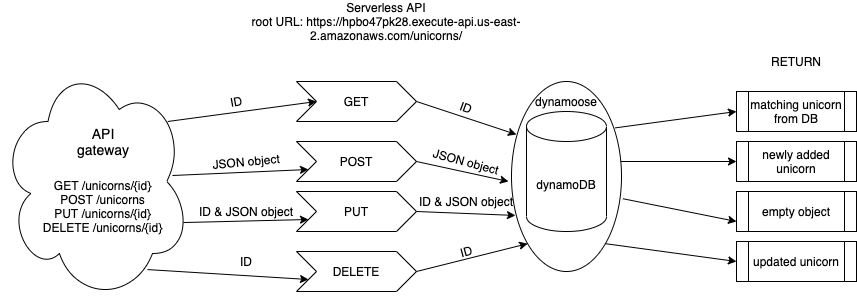

# Lab 18: Serverless API

## Sara Strasner

## UML

## What is the root URL to your API?
https://hpbo47pk28.execute-api.us-east-2.amazonaws.com/unicorns/   

## Routes
| Route       | Input       | Output      | 
| ----------- | ----------- | ----------- | 
| GET: https://hpbo47pk28.execute-api.us-east-2.amazonaws.com/unicorns/          | none        | all unicorns in database   | 
| https://hpbo47pk28.execute-api.us-east-2.amazonaws.com/unicorns/{id}          | an ID in request query      | the unicorn matching that ID (if a valid id)   | 
| POST: https://hpbo47pk28.execute-api.us-east-2.amazonaws.com/unicorns        | A JSON object with the kvps: "horns": number, "name":"string", "isCute":boolean    | the newly added unicorn  | 
| DELETE: https://hpbo47pk28.execute-api.us-east-2.amazonaws.com/unicorns/{id}   | an ID in request query           | an empty object   | 
| UPDATE: https://hpbo47pk28.execute-api.us-east-2.amazonaws.com/unicorns/{id}   | an ID in request query and a JSON object with at least one of the following kvps: "horns": number, "name":"string", "isCute":boolean           | the updated unicorn   | 
